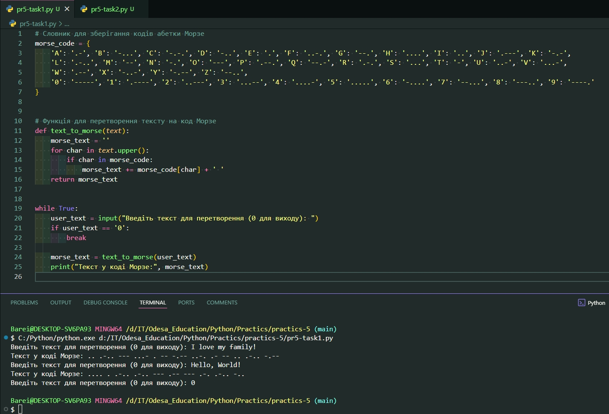
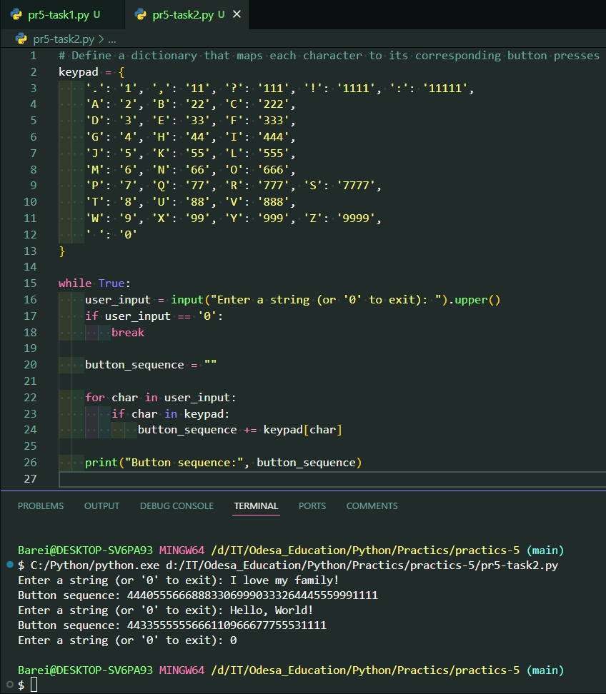

# Практична робота 5.

На цій практичній роботі реалізовано два завдання.

> **Завдання 1:** "Абетка Морзе" зашифровує літери та цифри за допомогою точок та тире.

Результати тестування:

> **Завдання 2:** Програмка, яка відображає послідовність кнопок, яку потрібно натиснути, щоб на екрані телефону з'явився текст, введений користувачем.

Результати тестування:

